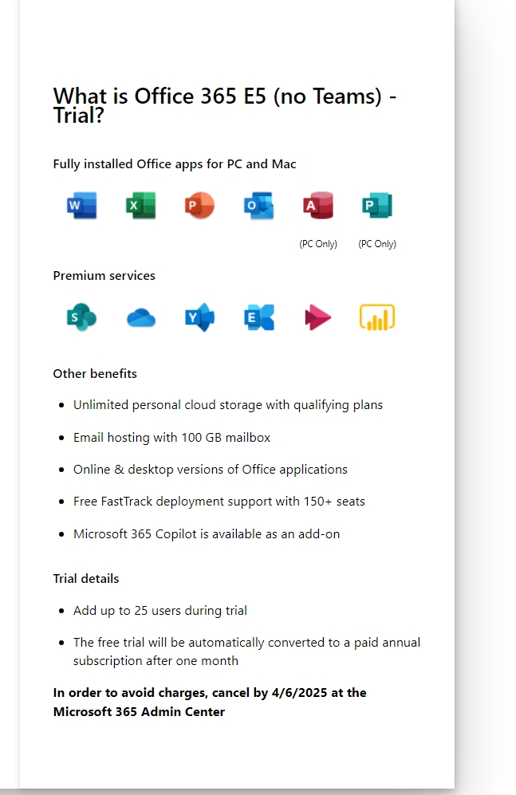
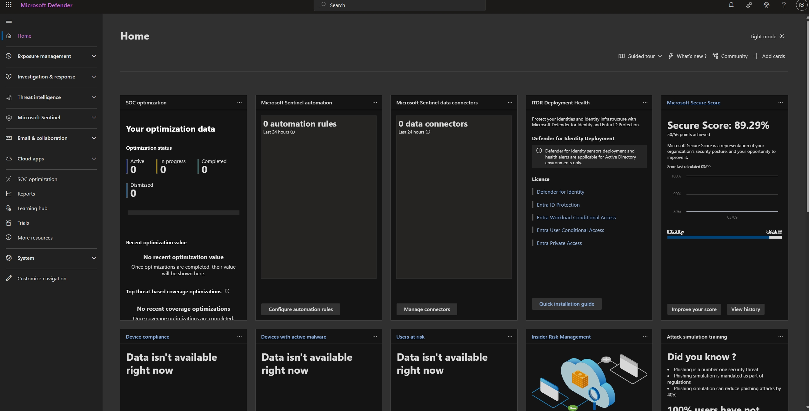
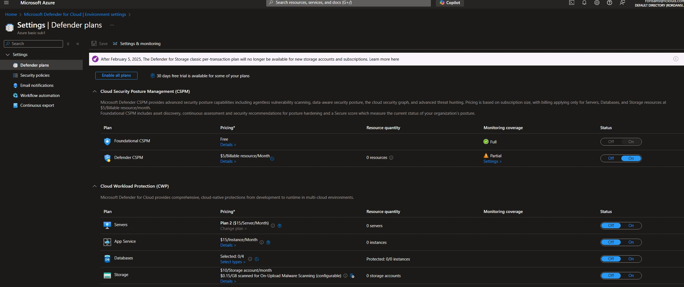
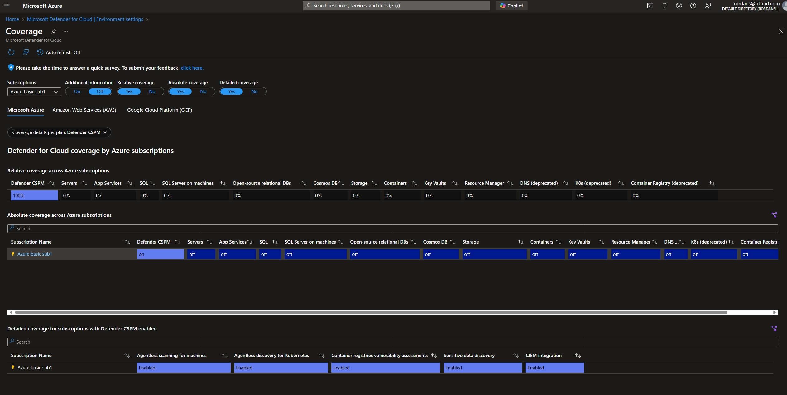
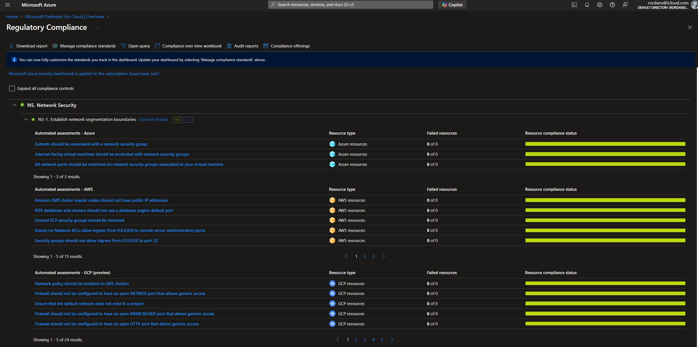
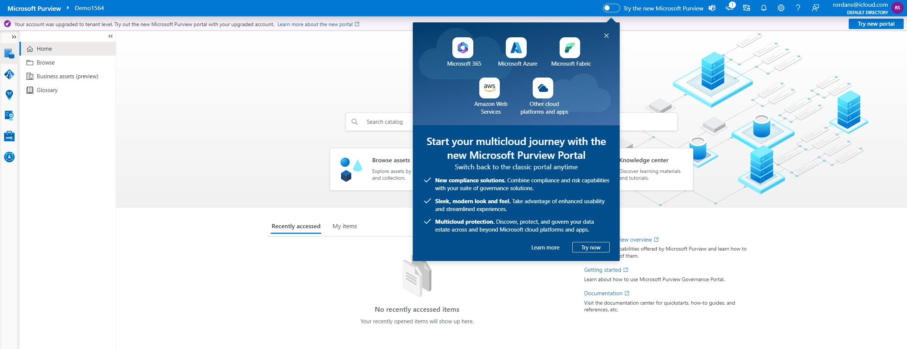
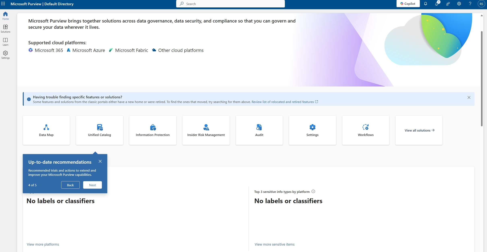
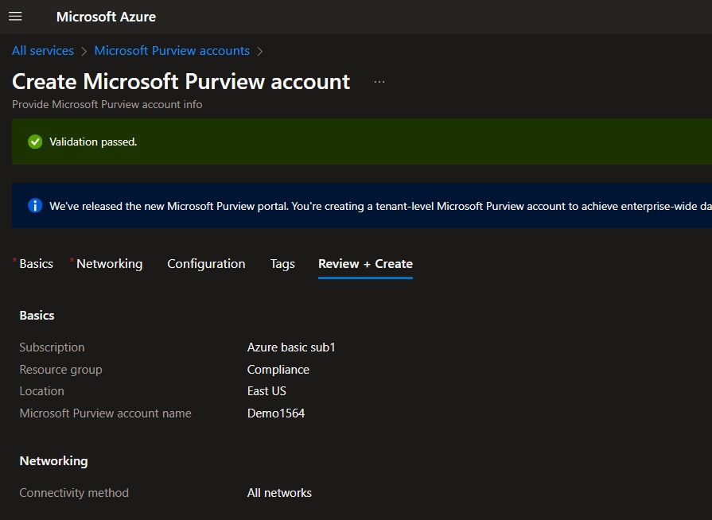
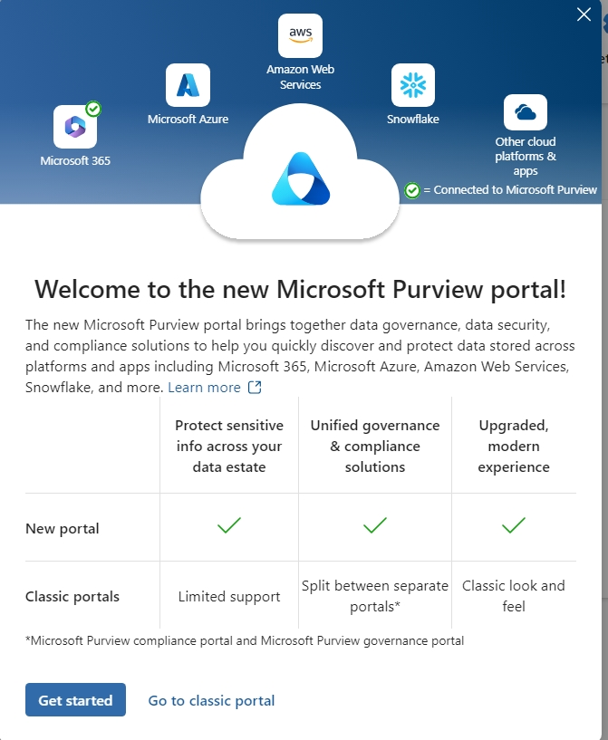
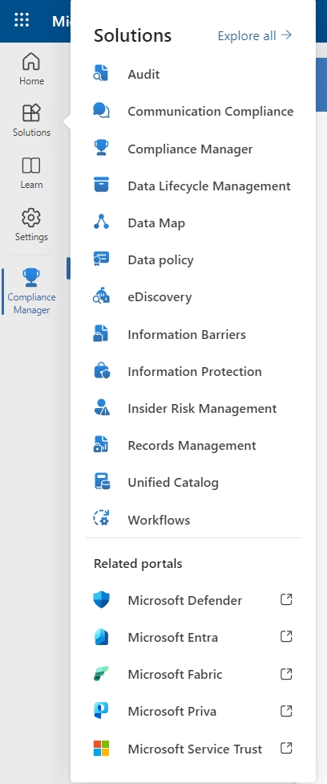

## Switching Defender CSPM to "On" enables features for monitoring, identifying risks, and improving cloud security posture as a whole.

## Setting up a Microsoft 365 E5 subscription allows for even further advanced features such as Microsoft Defender for Endpoint, Identity, and Office 365, as well as tools for insider risk management, data governance.

 
 
## Will need to cancel subscription if only using for practice.

   
  
   ## Access to full Defender Dashboard now accessable.
  

  ## Staying focused on Defender for Cloud, its possible to select as few or as many features as necessary.
  
    

  ## The security enhancements options available to help protect workloads and improve security posture continue in this settings and monitoring page.
   
    

 ## Workload Protection Alerts are specific to threats detected in individual resources, showcasing the nature of the threat, and remediation steps.
   
   

 ## Provides insights into which resources in an environment are protected and monitored by Defender.
   

 ## Can evaluate configurations against benchmarks like the Azure Security Benchmark and provides actionable recommendations.
   
 
   
   
   ## Microsoft Purview is a comprehensive data governance and compliance solution. 
   
    
   
  ## It helps organizations manage sensitive data, ensure regulatory compliance, and govern data across on-premises, multicloud, and SaaS environments. 
   
    
   
   ## Purview includes tools for data classification, retention policies, eDiscovery, and risk management.

    

   ## Steps to create an account.
   
   
    

   ## Account creation workflow continued
   
   
    
   
   ## Confirm upgrades
   
    

## Progress bar

## Deployment completion

   
   ## Data governance insights in the new Microsoft Purview portal.

   

  
 
 
 ## Available Solutions
 
 

